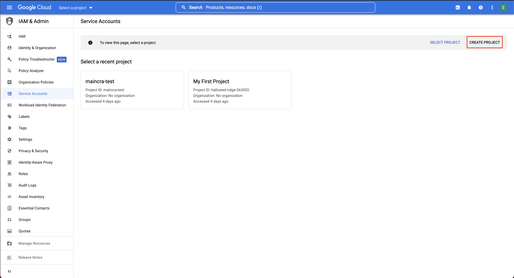
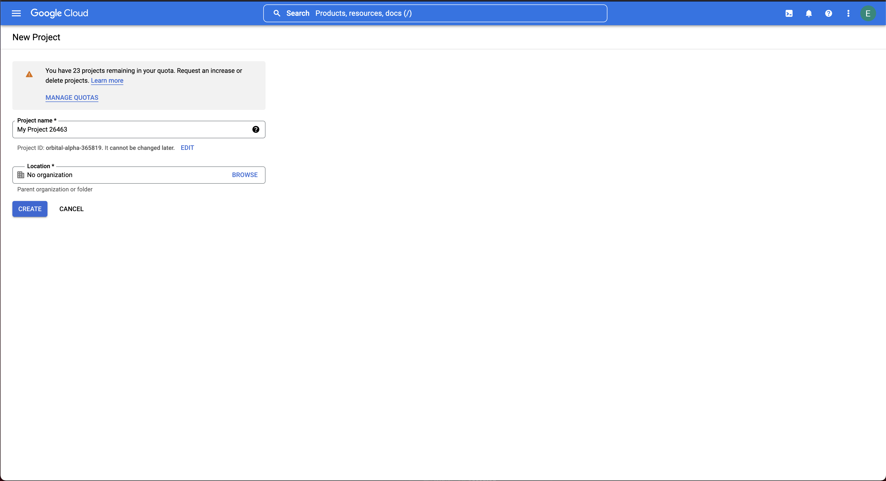
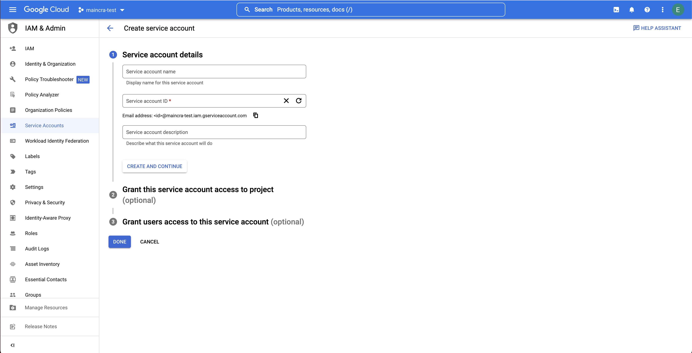
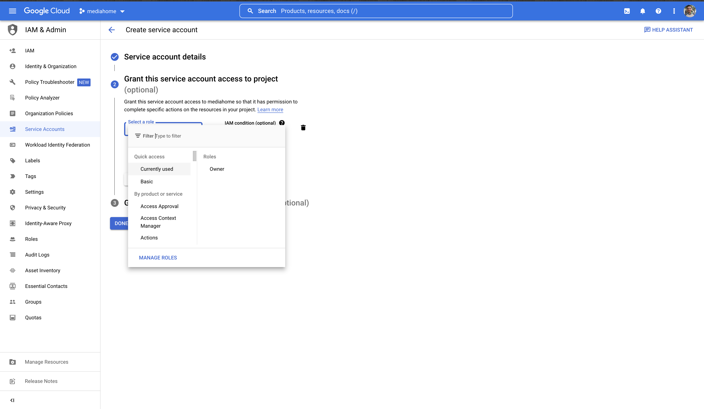
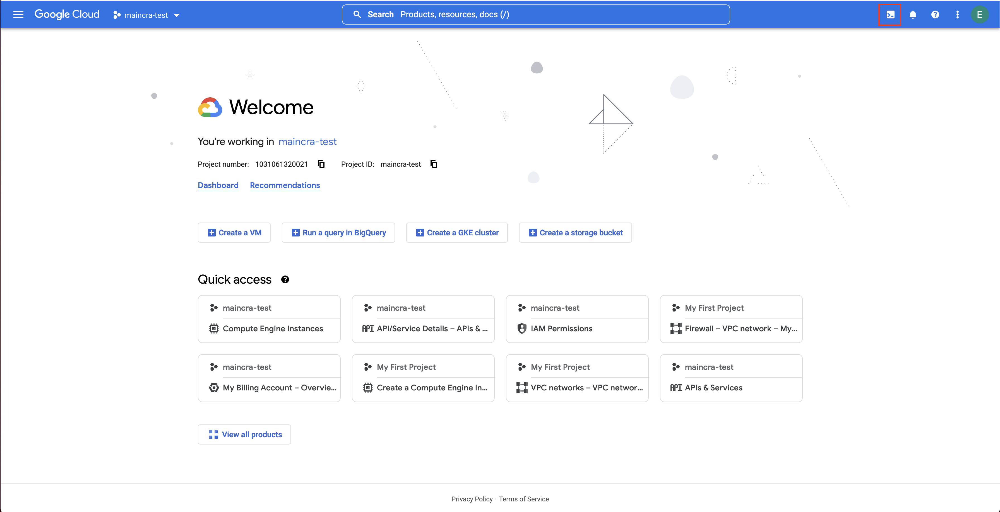
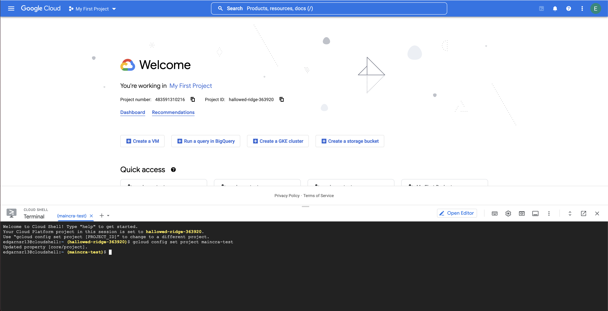

# Maincra Starter

[](https://github.com/RichardLitt/standard-readme)

> Minecraft starter used for CreepersLand server creation.

## Table of Contents

- [Maincra Starter](#maincra-starter)
  - [Table of Contents](#table-of-contents)
  - [Security](#security)
  - [Background](#background)
    - [In what consists?](#in-what-consists)
    - [Images](#images)
    - [Pre-installed tools](#pre-installed-tools)
  - [Usage](#usage)
        - [Main process](#main-process)
      - [For destroying your infrastructure](#for-destroying-your-infrastructure)
      - [If you want to use a backup file](#if-you-want-to-use-a-backup-file)
      - [Do you have a baremetal server?](#do-you-have-a-baremetal-server)

## Security

This script creates some keys for the server access. Don't share it to anyone that don't manage your minecraft server. Also you will need to provide Gcloud json creds to the script.

## Background

### In what consists?

This script initiates all the neccesary infrastructure to create one server, configuring all the neccesary tools, and providing a backup if it's specified. It uses docker.

### Images

https://hub.docker.com/r/itzg/minecraft-server
https://hub.docker.com/r/itzg/mc-backup

### Pre-installed tools

- docker :whale:
- zip :floppy_disk:
- bash :scroll:
- Terraform :wrench:

## Usage

- Go to this link, and first create a new project
  [Create new project](https://console.cloud.google.com/projectselector/iam-admin/serviceaccounts/create?_ga=2.117243718.1170366991.1665417377-1266140962.1664402679&_gac=1.196159326.1664403025.CjwKCAjw4c-ZBhAEEiwAZ105RUjsysQV6gEd2MzPmGaxd7bfKg4JwQhfQY55SGlOsNLzLOBf9PWOAhoCS5gQAvD_BwE)

  

  - Name it as you want, also you can edit the project-id, please save the id for future steps

  

  - Go again to this link and select your new project
  [Create new User](https://console.cloud.google.com/projectselector/iam-admin/serviceaccounts/create?_ga=2.117243718.1170366991.1665417377-1266140962.1664402679&_gac=1.196159326.1664403025.CjwKCAjw4c-ZBhAEEiwAZ105RUjsysQV6gEd2MzPmGaxd7bfKg4JwQhfQY55SGlOsNLzLOBf9PWOAhoCS5gQAvD_BwE)

  - Create a new Service user

  

  - Also give the permissions as owner to the service user (since this project is intended only for this service is ok)
  
  

- You need the shell for the next steps

  

- Select your new project with this command

```
gcloud config set project projectid
```

  

- After selecting the project run the next commands to enable needed services

```
gcloud services enable storage.googleapis.com
gcloud services enable compute.googleapis.com
gcloud services enable cloudbilling.googleapis.com
```

##### Main process

1. When it prompts you for the project, create a new one
1. Copy the json that gcloud provides you to the root path of this repo in your local (Don't push it into remote!)
1. Specify the name of the new project into the infrastructure/variables.tf file
1. do make all
1. wait
1. done

#### For destroying your infrastructure

1. do make destroy (the script will make a backup of your server files)
1. done

#### If you want to use a backup file

1. Put your backup.zip file in the root path of this repo (Don't push it into remote!)
1. Change variable use_backup in infrastructure/variables.tf to yes
1. do the [main](#mainprocess) process


#### Do you have a baremetal server?

There is an option for provisioning the server if you have a baremetal server.

you need a **private key** for your server for an user with **SUDO** access.

Run
``USERHOST=[user] IPHOST=[ip] make baremetalProvision``
(replace variables values with yours)

makefile will check if you have plugins.zip and backup.zip files on the path ./server-conf/
if a file exists, will be copied into the server and used.